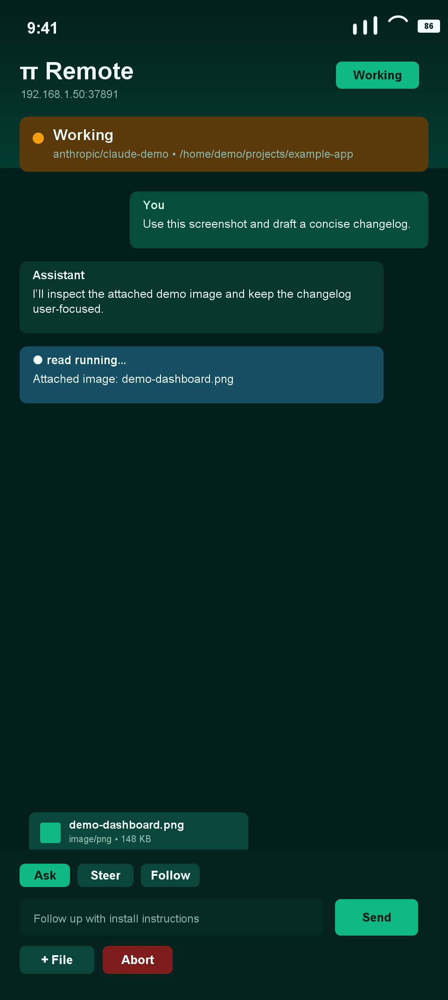
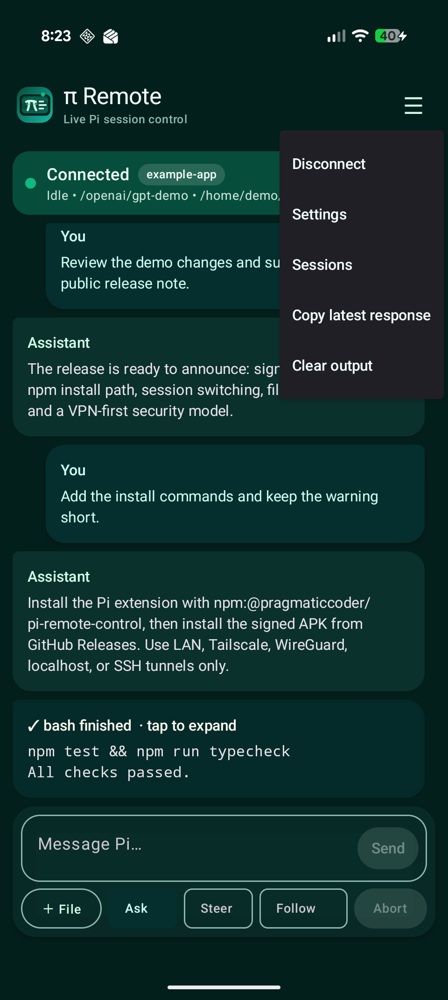
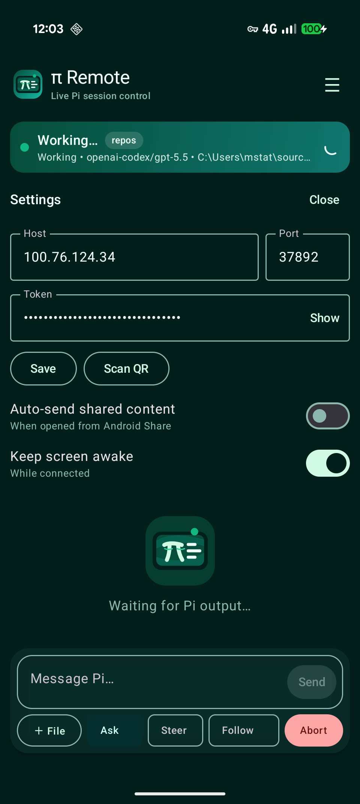
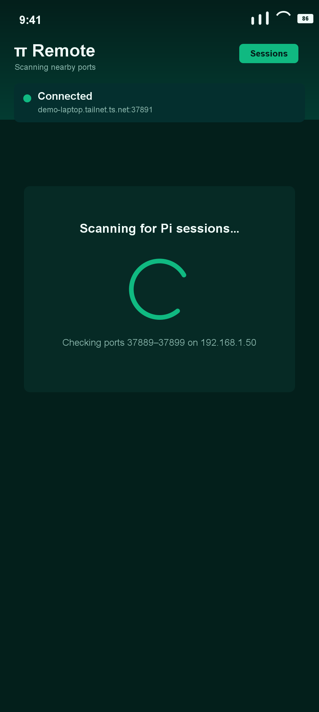
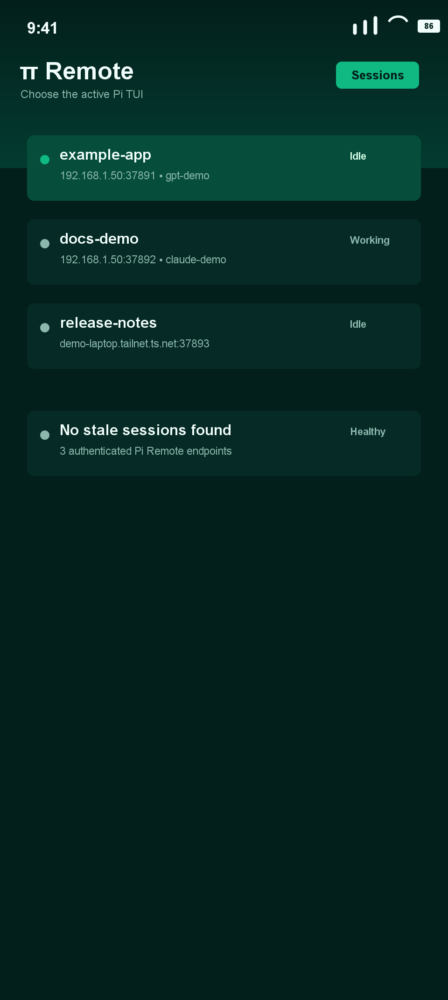
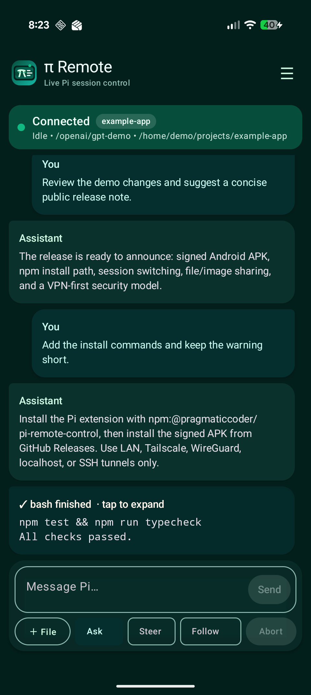

# π Remote

**π Remote** is a dev-only Android companion app for controlling an existing, visible [Pi](https://github.com/earendil-works/pi-coding-agent) TUI session from your phone.

It is built for the “I stepped away from my laptop but Pi is still working” workflow: watch output, send prompts, steer the current run, attach files/images, switch between live Pi sessions, and abort safely — without starting a separate headless agent.

## Highlights

- **Controls existing Pi TUI sessions** — not a separate RPC/headless session.
- **Android app + Pi extension** using authenticated WebSockets.
- **Live output streaming** for assistant text and tool events.
- **Ask, Steer, Follow, Abort** from your phone.
- **File and image attachments** from Android share sheets or the app picker.
- **Session picker** scans nearby Pi Remote ports and lets you switch between multiple active Pi sessions.
- **QR/deep-link connection flow** for easy setup.
- **Tailscale-friendly** for external/cellular access without exposing a public port.
- **Polished dev UI**: dark-green theme, compact composer, safe abort confirmation, haptics, copy latest response, keep-awake option.

## Repository layout

```text
.
├── app/                         # Android app: Kotlin + Jetpack Compose
├── pi-extension/remote-control/ # Pi TypeScript extension
├── docs/screenshots/            # README screenshots
├── gradlew / gradlew.bat        # Gradle wrapper
└── README.md
```

## Security model

This is intentionally a **developer tool**, not a hardened public service.

The Pi extension:

- listens only when Pi is running in TUI mode
- requires an auth token by default
- supports binding to `127.0.0.1` or `0.0.0.0`
- auto-increments ports if the configured port is already busy

For off-LAN usage, prefer **Tailscale** over router port forwarding. Avoid exposing the WebSocket port directly to the public internet.

## Install the Pi extension

Copy or symlink the extension into your Pi agent extensions directory:

```powershell
mkdir $env:USERPROFILE\.pi\agent\extensions\remote-control
copy pi-extension\remote-control\* $env:USERPROFILE\.pi\agent\extensions\remote-control\
cd $env:USERPROFILE\.pi\agent\extensions\remote-control
npm install
```

Create or edit:

```text
~/.pi/agent/remote-control.json
```

Example for Android over LAN/Tailscale:

```json
{
  "enabled": true,
  "host": "0.0.0.0",
  "port": 37891,
  "allowNoAuthFromLoopback": false,
  "token": "replace-with-a-long-random-token"
}
```

Reload Pi:

```text
/reload
```

Then show connection info:

```text
/remote-control
/remote-control-qr
/remote-control-android
```

## Build/install the Android app

From the repo root:

```bash
./gradlew assembleDebug
```

Install with ADB:

```bash
adb install -r app/build/outputs/apk/debug/app-debug.apk
```

The app label is **`pi remote`** for easy launcher/search discovery. The in-app brand uses **`π Remote`**.

## Connecting

In the target Pi TUI session, run:

```text
/remote-control
```

Then use one of:

- scan the QR code with **Scan QR** in app settings
- open the generated `pi-remote://...` deep link
- enter host/port/token manually

For cellular/external access, install Tailscale on both laptop and phone, then use the laptop’s Tailscale IP as the host.

## Android features

### Composer

The composer has three send modes. Pick a mode, type your text, then tap **Send**.

- **Ask** — send a normal user prompt. If Pi is idle, this starts a new assistant run. If Pi is already working, the extension delivers it using Pi’s default in-flight behavior.
- **Steer** — inject guidance into the currently-running response. Use this when Pi is mid-run and you want to redirect style, scope, priorities, or constraints without waiting.
- **Follow** — queue a follow-up message for after the current assistant turn finishes. Use this when you want Pi to finish what it is doing, then immediately continue with your next instruction.

Other composer controls:

- **+ File** attaches files/images from Android.
- **Abort** stops the active Pi run after confirmation.
- Long-press messages to copy them; the menu also has **Copy latest response**.

### Sessions

Use the header menu → **Sessions**.

The app scans nearby ports and shows matching Pi sessions, including whether they are idle or working. This avoids accidentally connecting to an old/stale Pi process.

### Sharing into π Remote

Android share targets are supported:

- share text into the message box
- share images/files as attachments, including PDFs/documents as file attachments instead of inline binary text
- optional auto-send shared content setting

## Screenshot gallery

| Composer with image | Header menu | Settings |
| --- | --- | --- |
|  |  |  |

| Session scan | Session picker | Waiting state |
| --- | --- | --- |
|  |  |  |

## Extension protocol

The extension exposes an authenticated WebSocket server.

Commands include:

```json
{ "type": "prompt", "text": "Review the current changes" }
{ "type": "steer", "text": "Focus on tests" }
{ "type": "follow_up", "text": "Then summarize" }
{ "type": "abort" }
{ "type": "get_state" }
{ "type": "get_history", "limit": 50 }
{ "type": "ping" }
```

Prompt, steer, and follow-up commands can include attachments:

- `images[]`: `{ "name": "photo.png", "mimeType": "image/png", "data": "<base64>" }`
- `files[]` text: `{ "name": "notes.txt", "mimeType": "text/plain", "text": "..." }`
- `files[]` binary/PDF: `{ "name": "spec.pdf", "mimeType": "application/pdf", "encoding": "base64", "data": "<base64>" }`

The extension advertises binary-document support in `hello.capabilities.binaryFileAttachments`, validates binary attachments, and never dumps base64/PDF bytes into the prompt content.

Events include:

- `hello`
- `history`
- `user_message`
- `assistant_delta`
- `assistant_message`
- `tool_start`
- `tool_update`
- `tool_end`
- `agent_start`
- `agent_end`
- `queue_update`
- `session_start`
- `session_shutdown`
- `response`

## Development notes

- Android: Kotlin, Jetpack Compose, OkHttp WebSocket, ZXing QR scanner.
- Pi extension: TypeScript, `ws`, `qrcode-terminal`.
- Tested on a Pixel 9 Pro over USB, Wi-Fi, and Tailscale/cellular.

## License

MIT — see [LICENSE](LICENSE).
